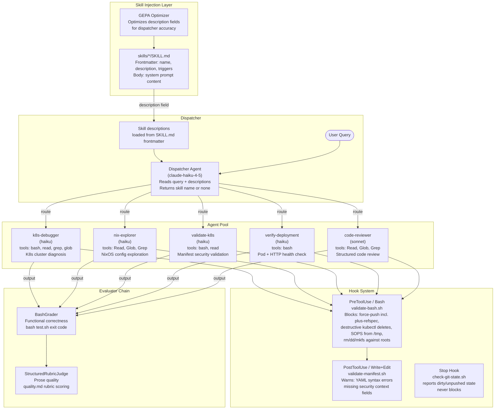
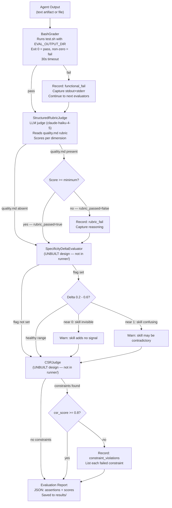

# Agentic Lifecycle: This Repository's Architecture

How this repository's skills, dispatcher, agents, hooks, and evaluators fit together — the parts that run, and nothing else.

---

## Table of Contents

1. [Overview](#1-overview)
2. [Our System: claude-code-skills Architecture](#2-our-system-claude-code-skills-architecture)
3. [Evaluator Chain Detail](#3-evaluator-chain-detail)
4. [Session Hooks (current reality)](#4-session-hooks-current-reality)

## 1. Overview

An **agentic system** is one where a language model does not produce a single response and halt — it instead drives a loop of reasoning, action, and observation until some termination condition is met. The word "agentic" describes systems where the model has agency over a sequence of tool calls, sub-task delegations, and state mutations whose downstream effects may be difficult or impossible to reverse.

Understanding the agentic lifecycle matters for three reasons:

**Correctness.** Without a clear mental model of how goals decompose into tasks, how tasks get routed to specialist agents, and how outputs get evaluated before being accepted, subtle failures compound silently across pipeline stages.

**Safety.** Agents that write to filesystems, push to git repositories, modify Kubernetes clusters, or make API calls carry real risk. Trust boundaries, hook-based safety guards, and human-in-the-loop checkpoints exist to intercept errors before they propagate.

**Observability.** A long-running agent session that writes dozens of files, spawns sub-agents, and loops through a goal queue must emit structured events at each phase transition so operators can monitor progress without relying on log scraping.

This document records THIS repository's architecture only. The generic
multi-agent background it once carried (ReAct loops, workflow topologies,
swimlanes, memory architectures) was cut 2026-10-09: it is public
literature, not a property of this system -- see Citations for the
primary sources.

---

## 2. Our System: claude-code-skills Architecture

This section maps the repository's concrete files to their roles: skills as routing-keyed system prompts, agents as stateless invocations, hooks at the tool-call boundary, evaluators behind them.

```mermaid
graph TD
    subgraph "Skill Injection Layer"
        SKILLDOCS["skills/*/SKILL.md\nFrontmatter: name, description, triggers\nBody: system prompt content"]
        GEPA["GEPA Optimizer\nOptimizes description fields\nfor dispatcher accuracy"]
        GEPA --> SKILLDOCS
    end

    subgraph "Dispatcher"
        DESC["Skill descriptions\nloaded from SKILL.md frontmatter"]
        DISP["Dispatcher Agent\n(claude-haiku-4-5)\nReads query + descriptions\nReturns skill name or none"]
        SKILLDOCS -->|"description field"| DESC
        DESC --> DISP
        QUERY([User Query]) --> DISP
    end

    subgraph "Agent Pool"
        A1["k8s-debugger\n(haiku)\ntools: bash, read, grep, glob\nK8s cluster diagnosis"]
        A2["nix-explorer\n(haiku)\ntools: Read, Glob, Grep\nNixOS config exploration"]
        A3["validate-k8s\n(haiku)\ntools: bash, read\nManifest security validation"]
        A4["verify-deployment\n(haiku)\ntools: bash\nPod + HTTP health check"]
        A5["code-reviewer\n(sonnet)\ntools: Read, Glob, Grep\nStructured code review"]
        DISP -->|"route"| A1
        DISP -->|"route"| A2
        DISP -->|"route"| A3
        DISP -->|"route"| A4
        DISP -->|"route"| A5
    end

    subgraph "Hook System"
        H1["PreToolUse / Bash\nvalidate-bash.sh\nBlocks: force-push incl. plus-refspec,\ndestructive kubectl deletes, SOPS from /tmp,\nrm/dd/mkfs against roots"]
        H2["PostToolUse / Write+Edit\nvalidate-manifest.sh\nWarns: YAML syntax errors\nmissing security context fields"]
        H3["Stop Hook\ncheck-git-state.sh\nreports dirty/unpushed state\nnever blocks"]
    end

    subgraph "Evaluator Chain"
        E1["BashGrader\nFunctional correctness\nbash test.sh exit code"]
        E2["StructuredRubricJudge\nProse quality\nquality.md rubric scoring"]
        E1 --> E2
    end

    A1 & A2 & A3 & A4 & A5 --> H1
    H1 --> H2
    A1 & A2 & A3 & A4 & A5 -->|"output"| E1
```

*The claude-code-skills system architecture. Skills inject domain knowledge as system prompts; the dispatcher routes queries; agents execute with tool access bounded by role; hooks intercept at PreToolUse, PostToolUse, and Stop; the shipped evaluator chain measures two dimensions (functional correctness, rubric quality).*

**Key architectural decisions:**

The skill description field in `SKILL.md` frontmatter is both the routing key and the optimization target. The GEPA optimizer treats descriptions as mutable parameters and runs evolutionary search over them, using trigger eval accuracy as the fitness function. This means the routing layer self-improves as new trigger test cases are added.

Agents are not long-running processes — they are stateless Claude invocations with a specific system prompt (the skill body). The "agent pool" is virtual: routing happens by selecting which SKILL.md body to inject, not by selecting a different process or container.

The hook system operates at the tool call boundary, not at the agent level. Every agent — regardless of which skill loaded it — is subject to the same PreToolUse, PostToolUse, and Stop hooks. This means safety rules are not per-agent but per-deployment-context.

---

## 3. Evaluator Chain Detail

The shipped evaluator chain is two-tier: BashGrader catches structural failures that rubric scoring misses; StructuredRubricJudge scores prose quality. (SpecificityDelta and CSRJudge remain unbuilt designs — see the design-note below.)

```mermaid
flowchart TD
    OUTPUT["Agent Output\n(text artifact or file)"]

    OUTPUT --> BG

    BG["BashGrader\nRuns test.sh with EVAL_OUTPUT_DIR\nExit 0 = pass, non-zero = fail\n30s timeout"]
    BG -->|"pass"| SRJ
    BG -->|"fail"| BG_FAIL["Record: functional_fail\nCapture stdout+stderr\nContinue to next evaluators"]
    BG_FAIL --> SRJ

    SRJ["StructuredRubricJudge\nLLM judge (claude-haiku-4-5)\nReads quality.md rubric\nScores per dimension"]
    SRJ -->|"quality.md present"| SRJ_SCORE{"Score >= minimum?"}
    SRJ -->|"quality.md absent"| SDE
    SRJ_SCORE -->|"yes — rubric_passed=true"| SDE
    SRJ_SCORE -->|"no — rubric_passed=false"| SRJ_FAIL["Record: rubric_fail\nCapture reasoning"]
    SRJ_FAIL --> SDE

    SDE["SpecificityDeltaEvaluator\n(UNBUILT design — not in runner/)"]
    SDE -->|"flag set"| SDE_CHECK{"Delta 0.2 - 0.6?"}
    SDE -->|"flag not set"| CSRJ
    SDE_CHECK -->|"healthy range"| CSRJ
    SDE_CHECK -->|"near 0: skill invisible"| SDE_WARN["Warn: skill adds no signal"]
    SDE_CHECK -->|"near 1: skill confusing"| SDE_WARN2["Warn: skill may be contradictory"]
    SDE_WARN --> CSRJ
    SDE_WARN2 --> CSRJ

    CSRJ["CSRJudge\n(UNBUILT design — not in runner/)"]
    CSRJ -->|"constraints found"| CSR_CHECK{"csr_score >= 0.8?"}
    CSRJ -->|"no constraints"| REPORT
    CSR_CHECK -->|"yes"| REPORT
    CSR_CHECK -->|"no"| CSR_FAIL["Record: constraint_violations\nList each failed constraint"]
    CSR_FAIL --> REPORT

    REPORT["Evaluation Report\nJSON: assertions + scores\nSaved to results/"]
```

*The shipped two-tier chain with decision branches; the SpecificityDelta/CSRJudge boxes below the fold are UNBUILT designs kept for reference, not running code.*

**Why two shipped tiers (and two designed, unbuilt)?**

A single LLM judge would conflate functional correctness with prose quality. The shipped tiers are orthogonal:

- BashGrader is model-free and deterministic — it does not drift.
- StructuredRubricJudge measures quality against a human-authored rubric, catching outputs that are structurally correct but technically wrong or shallow.

Two further dimensions were designed and never built — a skill-impact delta
against a no-skill baseline, and a constraint-satisfaction judge over
SKILL.md rules. Nothing in `runner/` implements them; build them only if
the two shipped tiers prove insufficient.

---

## 4. Session Hooks (current reality)

The claude-worker goal loop described in earlier revisions was retired with
the VM fleet. Today's Stop chain is a single git-state reporter
(hooks/check-git-state.sh); per-edit validators and the loop detector are
the PreToolUse/PostToolUse chain, all wired in nixos-config's mcp.nix and
tested by tests/test-hooks.sh.

## Anthropic Workflow Patterns Reference

The five patterns from Anthropic's agent documentation, mapped to this system:

| Pattern | Topology | Lifecycle phase | Example in this system |
|---|---|---|---|
| Prompt Chaining | Pipeline / Sequential | Planning + Tool execution | Skill body injected before user message; dispatcher runs before agent |
| Routing | DAG — conditional | Goal intake + routing | Dispatcher selects skill (the phase-routing Stop hook is retired — see §4) |
| Parallelization — Sectioning | Fan-out / Fan-in | Inter-agent delegation | Multiple evals run concurrently per `--max-concurrency` |
| Parallelization — Voting | Fan-out + consensus | Output evaluation | `--repeat N` + pass@k estimation across N independent runs |
| Orchestrator-Workers | Hierarchical | Full lifecycle | (conceptual — no orchestrator ships here; nearest real example is the sdlc walker dispatching stage agents) |
| Evaluator-Optimizer | Recursive / Cyclical | Evaluation + optimization | GEPA optimizer loops over dispatcher accuracy until stop condition |

---

## Citations

- Yao, S., et al. "ReAct: Synergizing Reasoning and Acting in Language Models." arXiv:2210.03629 (2022). — ReAct loop (background reading; the generic ReAct section was cut).
- Chen, M., et al. "Evaluating Large Language Models Trained on Code." arXiv:2107.03374 (2021). — pass@k unbiased estimator (Section 3, eval framework).
- Zhou, J., et al. "Instruction-Following Evaluation for Large Language Models." arXiv:2311.07911 (2023). — CSR / rule-based evaluation (Section 3).
- Anthropic. "Building effective agents." Anthropic documentation (2024). — Five workflow patterns (the table above).
